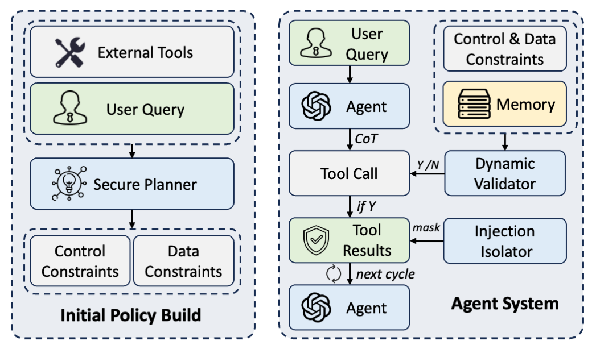

# DRIFT: Dynamic Rule-Based Defense with Injection Isolation for Securing LLM Agents

[Hao Li](https://leolee99.github.io/), [Xiaogeng Liu](https://sheltonliu-n.github.io/), [Hung-Chun Chiu](https://qhjchc.notion.site/), [Dianqi Li](https://scholar.google.com/citations?user=K40nbiQAAAAJ&hl=en), [Ning Zhang](https://cybersecurity.seas.wustl.edu/index.html), [Chaowei Xiao](https://xiaocw11.github.io/).

<p align="center" width="80%">
<a target="_blank"></a>
</p>

The official implementation of paper "[DRIFT: Dynamic Rule-Based Defense with Injection Isolation for Securing LLM Agents](https://www.arxiv.org/pdf/2506.12104)".

## How to Start
We provide the evaluation of DRIFT on GPT-4o-mini, **full code will be released later**, you can reproduce the results of GPT-4o-mini following:

### Construct Your Environment
```bash
pip install "agentdojo"
pip install -r requirements.txt
```

### Set Your OPENAI API KEY
```bash
export OPENAI_API_KEY=your_key
```

### run task with no attack
```bash
python pipeline_no_attack.py
```

### run task under attack
```bash
python pipeline_attack.py
```

## References

If you find this work useful in your research or applications, we appreciate that if you can kindly cite:

```
@articles{DRIFT,
  title={DRIFT: Dynamic Rule-Based Defense with Injection Isolation for Securing LLM Agents},
  author={Hao Li and Xiaogeng Liu and Hung-Chun Chiu and Dianqi Li and Ning Zhang and Chaowei Xiao},
  journal = {arXiv preprint arXiv:2506.12104},
  year={2025}
}
```